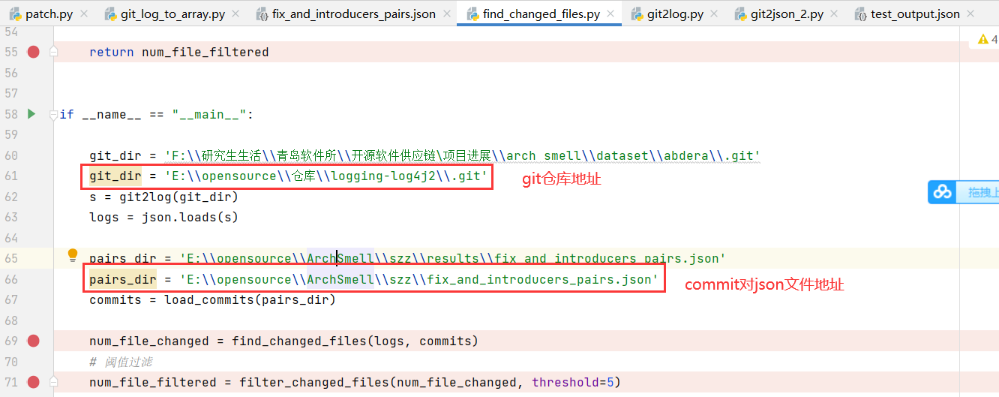

# 使用

1. 运行patch.py,修改下图中的参数，运行结果是4条cmd命令


```bash
# patch.py 输出
python git_log_to_array.py --from-commit a392a16688a788d615d1f0ac696c5f64e4ca32b1 --repo-path "D:\opensource\仓库\logging-log4j2"

python fetch.py --issue-code LOG4J2 --jira-project issues.apache.org/jira

python find_bug_fixes.py --gitlog gitlog/logging-log4j2/gitlog.json --issue-list issues/LOG4J2/ --gitlog-pattern "LOG4J2-{nbr}\D|#{nbr}\D" --output "issues_lists/logging-log4j2/"

java -jar ./szz_find_bug_introducers-0.1.jar -i ../issues_lists/logging-log4j2/issue_list.json -r "D:\opensource\仓库\logging-log4j2"
```


2. 在ArchSmell文件夹下运行前三条命令

3. 进入szz文件夹，运行第四条命令

   -  运行结束后，在`szz/result/`文件夹下会输出`fix_and_introducers_pairs.json`文件，包含了引入bug和修复bug的commit对

4. 修改`find_changed_files.py`文件的参数

   - 

   - 文件修改次数保存在`num_file_filtered`字典中